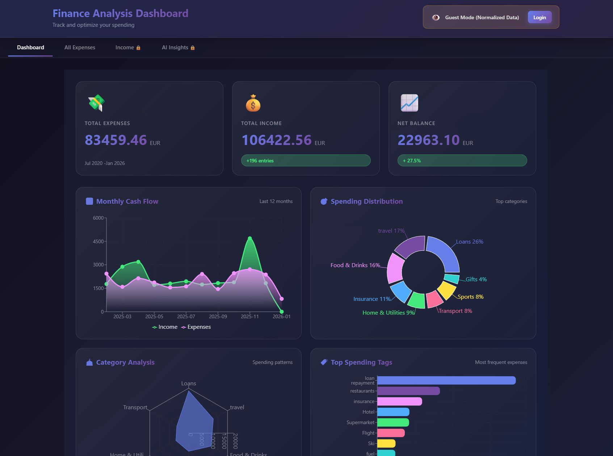

# 🏖️ AI Financial Advisor Dashboard

> **My self-built AI financial advisor that told me how to retire early** (and roasted my restaurant spending 😂)

A beautiful, secure web application for analyzing your personal finances with **AI-powered insights** using Claude Sonnet 4.5. Built entirely through "vibe coding" with Claude Code - zero manual coding required!


*Full-featured financial dashboard with interactive charts and AI chat interface*

## ✨ Features

### 📊 Interactive Financial Dashboard
- **Smart Visualizations**: Beautiful charts showing spending by category, monthly trends, and yearly comparisons
- **Income & Expense Tracking**: Complete financial picture with both sides of your budget
- **Real-Time Search**: Instantly find transactions by keyword (e.g., "skiing", "restaurant")
- **Responsive Design**: Works seamlessly on desktop, tablet, and mobile

### 🤖 AI Financial Advisor (Powered by Claude Sonnet 4.5)
- **Personalized Insights**: Get tailored financial advice based on your actual spending patterns
- **Interactive Chat**: Natural conversation interface with persistent history
- **Quick Questions**: One-click access to common financial queries
- **Smart Analysis**: Ask anything from "When can I retire?" to "Should I switch careers?"


*Chat with your AI financial advisor about retirement, spending habits, and financial goals*

### 🔐 Production-Ready Security
- **Guest Mode**: Share your app publicly with randomized data for demos
- **Token Authentication**: Secure access to your real financial data
- **httpOnly Cookies**: Protection against XSS attacks
- **HTTPS Enforcement**: Automatic SSL in production
- **Rate Limiting**: Brute force protection (5 login attempts/min)
- **CORS Whitelist**: Domain-restricted API access
- **Auto-Expiring Sessions**: 30-minute timeout for security

### 🚀 Easy Deployment
- **One-Click Deploy**: Railway deployment with PostgreSQL
- **Environment-Based Config**: Automatic dev/prod detection
- **Docker Support**: Container-ready for self-hosting
- **CSV Import via CLI**: Secure data upload without web forms

## 🎯 Live Demo

**Try the live app**: [Your Railway URL here]

**Guest Mode**: Experience the full interface with randomized demo data
**Login**: Contact me for a demo token to see AI insights in action

## 🛠️ Tech Stack

- **Frontend**: React 18 + Vite, Recharts visualizations, React Markdown
- **Backend**: FastAPI (Python 3.13), Pandas for data processing
- **Database**: PostgreSQL (Railway) with SQLAlchemy ORM
- **AI**: Anthropic Claude Sonnet 4.5 API
- **Package Management**: uv (blazingly fast Python package manager)
- **Deployment**: Railway (full-stack), Docker support

## 📚 Documentation

- **[🚀 Deployment Guide](documentation/DEPLOYMENT.md)** - Complete Railway deployment (20-25 min)
- **[🔒 Security Guide](documentation/SECURITY.md)** - Security features & best practices
- **[🛠️ Development Guide](documentation/DEVELOPMENT.md)** - Local setup & API reference
- **[🤝 Contributing Guide](documentation/CONTRIBUTING.md)** - How to contribute to this project
- **[📦 UV Package Manager](documentation/UV_GUIDE.md)** - Fast dependency management

## 🚀 Quick Start

### Prerequisites

- Python 3.13+ with [uv](https://github.com/astral-sh/uv) installed
- Node.js 18+
- Anthropic API key ([get one free](https://console.anthropic.com/))

### 1. Clone & Install

```bash
# Clone the repository
git clone https://github.com/yourusername/finance-analysis.git
cd finance-analysis

# Install uv (if not installed)
curl -LsSf https://astral.sh/uv/install.sh | sh
```

### 2. Backend Setup

```bash
cd backend

# Generate authentication tokens
python auth.py
# Save these tokens securely!

# Create .env file
cat > .env << EOF
ANTHROPIC_API_KEY=your_anthropic_key_here
AUTH_TOKEN_1=your_token_from_auth_py
AUTH_TOKEN_2=your_partner_token_from_auth_py
EOF

# Install dependencies
uv pip install -e .

# Start backend server
uv run python main.py
```

Backend runs at http://localhost:8000

### 3. Frontend Setup

```bash
cd frontend

# Install dependencies
npm install

# Start development server
npm run dev
```

Frontend runs at http://localhost:3000

### 4. Add Your Data

**Option A: Local Development**
- Export your financial data from Toshl Finance as CSV
- Place CSV file in `data/` folder
- Backend auto-detects and loads it

**Option B: Production (Railway)**
- Use Railway CLI to upload data securely (see [Deployment Guide](documentation/DEPLOYMENT.md))
- Data stored in PostgreSQL database

## 💬 AI Insights Examples

The AI advisor analyzes your spending and provides personalized insights:

### "When can I retire on a beach?" 🏖️
> Based on your current savings rate and spending habits, you could retire in 15 years at age 55 with your current lifestyle. To retire earlier, consider reducing restaurant spending by 30% and increasing investments...

### "Should I become a ski instructor?" 🎿
> Interesting career change! Looking at your data, you spend €3,200/year on skiing but €4,800 on restaurants. If teaching skiing is your passion, you'd need to...

### "Could I buy a Lamborghini?" 🏎️
> With your current income and savings rate, investing your typical monthly surplus for 5 years would grow to €45,000. A Lamborghini costs €200,000+. However, if you reduced coffee expenses...

## 🔒 Security & Privacy

### Data Privacy
- **Your data stays yours**: Runs on your infrastructure or Railway account
- **No third-party tracking**: Zero analytics or external services
- **AI on-demand only**: Claude API only called when you explicitly request insights
- **Local processing**: All data analysis happens server-side, not in the cloud

### Guest Mode
Share your app publicly without exposing real numbers:
- All amounts randomized with daily-changing factors
- Relative proportions maintained (10% stays 10%)
- Categories, dates, and tags unchanged
- AI insights completely blocked

### Authentication
- **Secure tokens**: Generated with cryptographic randomness
- **Cookie-based auth**: httpOnly cookies prevent XSS
- **Session expiry**: 30-minute timeout
- **Rate limiting**: 5 failed attempts per minute

## 📦 Project Structure

```
finance-analysis/
├── backend/
│   ├── main.py              # FastAPI app & API endpoints
│   ├── database.py          # PostgreSQL ORM models
│   ├── auth.py              # Token generation & auth
│   ├── pyproject.toml       # uv dependencies
│   └── .env.example         # Environment template
├── frontend/
│   ├── src/
│   │   ├── components/      # React components
│   │   │   ├── Dashboard.jsx
│   │   │   ├── AIInsights.jsx
│   │   │   ├── ExpenseList.jsx
│   │   │   └── Login.jsx
│   │   ├── App.jsx          # Main app
│   │   └── main.jsx
│   ├── package.json
│   └── vite.config.js
├── documentation/           # Detailed guides
├── docker-compose.yml      # Docker setup
└── README.md              # This file
```

## 🎨 Screenshots

### Dashboard Overview

*Interactive charts showing spending categories, trends, and income analysis*

### AI Chat Interface

*Mobile-optimized chat interface with quick questions and persistent history*

### Search & Filter

*Instantly find transactions across categories, tags, and descriptions*

## 🚢 Deployment Options

### Railway (Recommended)
Complete PostgreSQL-backed deployment with automatic HTTPS:
```bash
railway login
railway init
railway link
railway up
```
See [Deployment Guide](documentation/DEPLOYMENT.md) for detailed steps.

### Docker
Self-host with Docker Compose:
```bash
docker-compose up -d
```

### Separate Services
- **Backend**: Railway, Heroku, or any Python host
- **Frontend**: Vercel, Netlify, or Cloudflare Pages

## 💰 Costs

### Free Tier
- **Railway**: Free $5/month credits (enough for hobby projects)
- **Anthropic API**: Free tier available, then pay-as-you-go

### Typical Monthly Costs
- **AI Insights**: $0.50-2.00/month (personal use)
- **Railway Hosting**: $5-10/month (includes PostgreSQL)
- **Total**: ~$5-12/month for full personal finance system

## 🤝 Contributing

This project was built entirely through "vibe coding" with Claude Code. Contributions welcome!

### Ideas for Enhancements
- Budget tracking and alerts
- Multi-currency support improvements
- Direct Toshl API integration for real-time sync
- TradeRepublic / broker integration for investment tracking
- PDF report exports
- Mobile app with React Native
- Automated monthly email reports
- Savings goals and projections

See [CONTRIBUTING.md](documentation/CONTRIBUTING.md) for guidelines.

## 📝 License

MIT License - free to use for personal or commercial projects.

See [LICENSE](LICENSE) for full details.

## 🙏 Credits & Acknowledgments

- **AI Development**: Built with [Claude Code](https://www.anthropic.com/claude-code) by Anthropic
- **AI Insights**: Powered by [Claude Sonnet 4.5](https://www.anthropic.com/claude)
- **Package Management**: [uv by Astral](https://github.com/astral-sh/uv)
- **Expense Tracking**: [Toshl Finance](https://toshl.com/)
- **Charts**: [Recharts](https://recharts.org/)
- **Framework**: [FastAPI](https://fastapi.tiangolo.com/) & [React](https://react.dev/)

## 💬 About "Vibe Coding"

This entire project was built without writing a single line of code manually. Using Claude Code, I described what I wanted, and the AI:
- Architected the full-stack application
- Wrote all frontend and backend code
- Implemented security features
- Set up database schemas
- Created deployment configurations
- Fixed bugs and optimized performance
- Built the AI chat interface

**I've been using Claude Code for a few months now and love it.** It's not just about generating code - it's about having an AI pair programmer who understands context, suggests best practices, and helps you build production-ready applications.

## 🐛 Troubleshooting

### Common Issues

**"Cannot connect to backend"**
- Check backend is running on port 8000
- Verify `VITE_API_URL` in frontend/.env
- Check CORS settings in backend/main.py

**"AI insights not available"**
- Verify `ANTHROPIC_API_KEY` in backend/.env
- Check API key is valid at [console.anthropic.com](https://console.anthropic.com/)
- Restart backend after adding key

**"Authentication failed"**
- Run `python backend/auth.py` to generate new tokens
- Copy tokens exactly (no quotes, no spaces)
- Clear browser localStorage and try again

**More solutions**: See [Troubleshooting Guide](documentation/DEVELOPMENT.md#troubleshooting)

## 📧 Support & Contact

- **Issues**: [GitHub Issues](https://github.com/yourusername/finance-analysis/issues)
- **Documentation**: Check the [documentation folder](documentation/)
- **API Docs**: http://localhost:8000/docs (when backend running)

## ⭐ Show Your Support

If you found this project helpful:
- ⭐ Star this repository
- 🐦 Share on Twitter/LinkedIn
- 🍴 Fork and build your own version
- 💬 Share your experience with Claude Code

---

**Built with 💜 using Claude Code** | **Powered by Claude Sonnet 4.5** | **MIT License**

*The numbers in screenshots are randomized for privacy. Real financial data requires authentication.*
